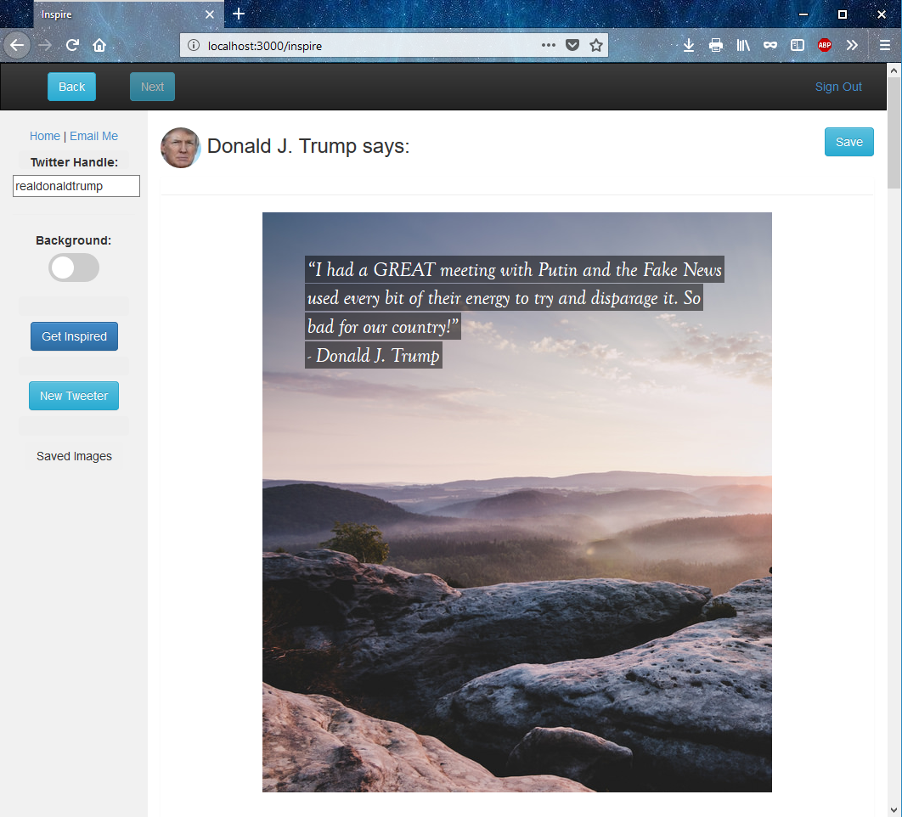

# InspireApp
Full stack class project for Boston University MIS CS602

CS602 Term Project
Justin Anderson
Inspire -
An exercise in juxtaposition. Frame ridiculous tweets from any Twitter user you desire. Choose beautiful landscapes or decrepit hellscapes.

Program includes all necessary files and CDN links.

In order to run this program using XAMPP, the following steps must occur:
1. Create a folder named 'CS602' under the 'htdocs' subdirectory of xampp (i.e. C:\xampp\htdocs\CS602)*
2. Paste 'CS602_termProject_anderson' under the 'CS602' subdirectory
3. Run 'mongod.exe' from the command line to start MongoDB
4. (Optional) Create the initial database example data using 'node connectDb.js' from the project folder
5. Run the webserver (node index.js from project folder) and navigate to the project URL from a Google Chrome browser (http://localhost:3000/)

If the exact path above is not used, Twitter will not recognize the associated OAuth keys.

Internet connection and Twitter account are required to use the app.

Notes:
*While the program does not use XAMPP to run, the file path is important as the Twitter API uses this in a callback.
- Authorization will request you connect with CS701 App API. This is due to the oAuth key being reused since my trial expired.

Twitter and Flickr RESTful API connections:
In order to test the RESTful Flickr and Twitter APIs, type the following into a command prompt:

---Flickr--- 
Command:
curl -X GET -H "Content-Type: application/json" http://127.0.0.1:3000/inspire/api/flickr
Response:
80 photo objects (JSON) with the tag "Natural Landscapes". 

---Twitter---
Command: 
curl -X GET -H "Content-Type: application/json" http://127.0.0.1:3000/inspire/api/twitter?handle=realdonaldtrump
Response:
100 tweet objects (JSON) from the user specified in the querystring.

Notes: 
- The cURL utility is not natively available with Windows. You can download it here: https://curl.haxx.se/download.html
- The twitter API will accept any Twitter handle in the querystring.
